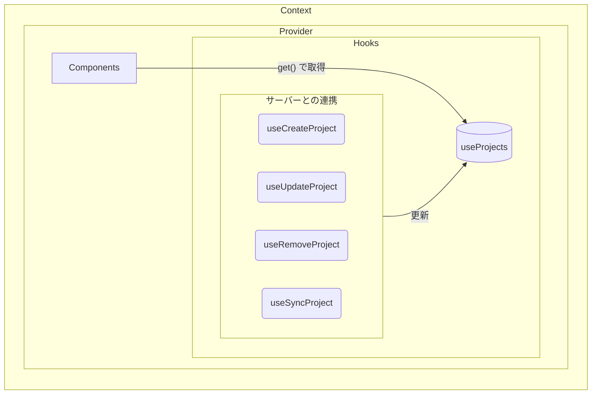

## プロジェクトのローカル保持について

projectはCtx内に保持されます。

Ctxとサーバーの同期はhookとして提供されます。

```mermaid
flowchart LR
  subgraph Context
    subgraph Provider
      subgraph Hooks
        projects[(useProjects)]
        subgraph serverSide[サーバーとの連携]
          create(useCreateProject)
          update(useUpdateProject)
          removeProject(useRemoveProject)
          syncProject(useSyncProject)
        end
      end

      Components --->|"get() で取得"| projects
    end
  end

  serverSide -->|更新| projects
```
